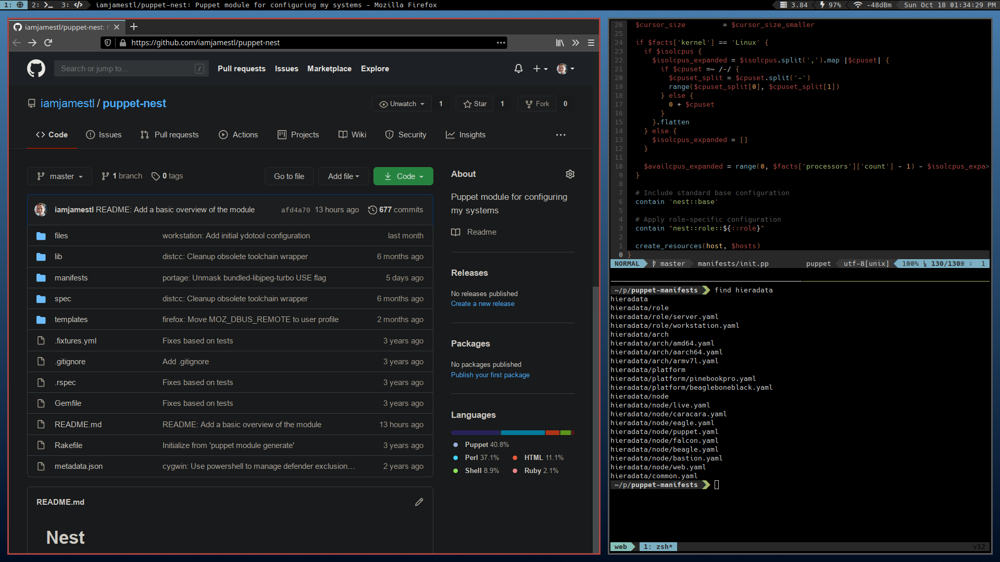

# Nest Configuration

Automation for my personal Linux distribution based on Gentoo

## Overview

This is a standard [Puppet module](https://www.puppet.com/docs/puppet/latest/modules_fundamentals.html) that provides all the configuration, data, and orchestration needed to build and maintain the [Nest distribution](https://james.tl/projects/nest/). It's also a [Bolt project](https://www.puppet.com/docs/bolt/latest/projects.html) for operational support and a [control repo](https://www.puppet.com/docs/pe/latest/control_repo.html) for desired state management.

## Usage

This module defines three main stages to progressively build server and workstation images for OCI containers and bare metal systems.

### Supported Platforms

| Arch   | CPU        | Platform                  |
|--------|------------|---------------------------|
| AMD64  | Haswell    | Generic                   |
|        |            | Live ISO/USB              |
|        |            | VMware                    |
| ARM    | Cortex-A8  | [BeagleBone Black](https://beagleboard.org/black)    |
| ARM64  | Cortex-A53 | [Pine64](https://www.pine64.org/)                    |
|        |            | [Radxa Zero](https://wiki.radxa.com/Zero)            |
|        |            | [Raspberry Pi 3](https://www.raspberrypi.com/products/raspberry-pi-3-model-b/) |
|        |            | [SOPine](https://www.pine64.org/sopine/)             |
|        | Cortex-A72 | [Pinebook Pro](https://www.pine64.org/pinebook-pro/) |
|        |            | [Raspberry Pi 4](https://www.raspberrypi.com/products/raspberry-pi-4-model-b/) |
|        |            | [Rock 4](https://wiki.radxa.com/Rock4)               |
|        |            | [Rock 5](https://wiki.radxa.com/Rock5)               |
|        |            | [RockPro64](https://www.pine64.org/rockpro64/)       |
| RISC-V | [RV64GC_XTheadVector](https://github.com/XUANTIE-RV/thead-extension-spec/blob/master/xtheadvector.adoc) | [Milk-V Pioneer](https://milkv.io/pioneer) |

Additionally, the module has comprehensive Kubernetes support.

## Related Projects

This configuration works with several other projects that provide data and logistical support for Nest:

### Build

These projects provide pipeline automation and container registries for the OS build:

* [**Stage 0**](https://gitlab.james.tl/nest/stage0): Updated Gentoo Stage 3 images containing Puppet
* [**Stage 1**](https://gitlab.james.tl/nest/stage1): Basic images intended for containers
* [**Stage 2**](https://gitlab.james.tl/nest/stage2): Platform-specific images with kernels
* [**Stage 3**](https://gitlab.james.tl/nest/stage3): Complete images for specific nodes

They use data and plans from this project.

### Portage

These repositories provide package management configuration data:

* [**Gentoo**](https://gitlab.james.tl/nest/gentoo/portage): Snapshot of the Gentoo Portage tree
* [**Haskell**](https://gitlab.james.tl/nest/gentoo/haskell): Snapshot of [the Gentoo Haskell tree](https://github.com/gentoo-haskell/gentoo-haskell)
* [**Overlay**](https://gitlab.james.tl/nest/overlay): Custom ebuilds and profiles

### Tools

* [**CLI**](https://gitlab.james.tl/nest/cli) ([GitHub](https://github.com/jameslikeslinux/nest-cli)): Commands for Nest administration
* [**Dotfiles**](https://gitlab.james.tl/james/dotfiles) ([GitHub](https://github.com/jameslikeslinux/dotfiles)): Dotfiles and other shared home directory things
* [**KubeCM**](https://gitlab.james.tl/james/kubecm) ([GitHub](https://github.com/jameslikeslinux/kubecm)): Orchestration for Kubernetes deployments
